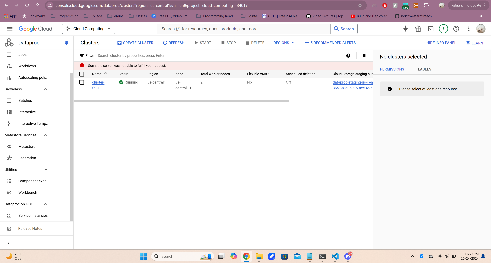
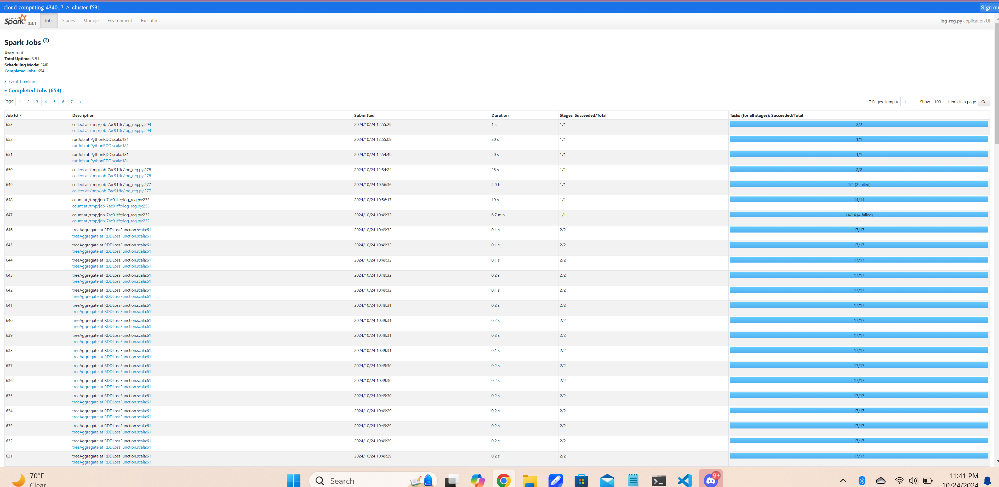

# Logistic Regression Text Classification

## Description
This project implements a **regularized logistic regression model** to classify text documents as either Wikipedia pages or Australian court cases. The workflow involves three main stages: 

1. **Data Preparation:** Parsing and preprocessing a large dataset of over 170,000 text documents for training, and 18,700 documents for testing.
2. **Model Training:** Training the logistic regression model using **gradient descent** to optimize classification accuracy.
3. **Model Evaluation:** Assessing model performance on a separate test dataset to ensure generalization.

The dataset includes approximately 1.9 GB of training data and 200 MB of test data, with a smaller 37.5 MB subset provided for local experimentation. This implementation emphasizes scalability, efficient text handling, and the application of cloud resources for processing large-scale datasets.

## Model Parameters Used:
- Number of Iterations: 100
- Regularization Parameter (regParam): 0.1
- Convergence Tolerance (tol): 0.000001

## Model Evaluation After Training:
- Total Data Points: 168886
- Correct Predictions: 168835
- Accuracy: 0.9989
- F1 Score: 0.9729

## Analysis of False Positives:
(Doc Id = 40752161) 
This is talking about "Reeves v. Sanderson Plumbing Products", which was a case before the US Supreme Court in 2000. This makes sense to be flagged as an Australian court case, as many of the words within the page would be similar to an Australian Court Case.

(Doc Id = 39521904) 
This is talking about "Genna-Wae Properties v Medico-Tronics", which was a case in the South African court of lease. Again, this makes sense to be flagged as an Australian court case, as much of the words within a South African court would be similar to an Australian court.

(Doc Id = 33738040) 
This is talking about "Geoff Campbell", who is a fictional character from the Australian soap opera, "Home and Away." While it doesn't have the same context as the other two court cases to an Australian court case, the words used are probably very similar as both texts are Australian in nature.

# Screenshots
### Proof of Deployment on Dataproc GKE Cluster

 

### Proof of Spark Job History
